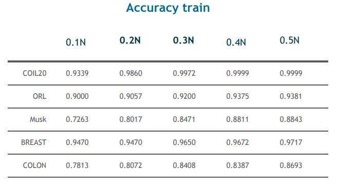
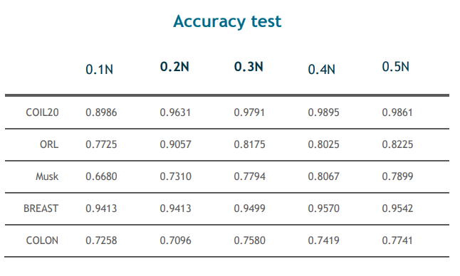
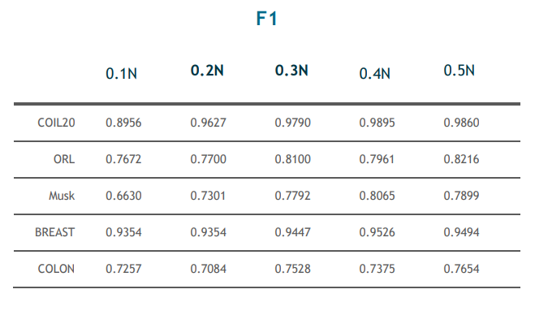

# feature-selection-with-the-highest-accuracy
Feature selection considering the composition of feature relevancy  based on information theory

1. A novel feature selection method based on information theory is proposed. 
2. The composition of feature relevancy is taken into account. 
3. Our method maximizes new information while minimizing redundancy information. 
4. Our method outperforms five competing methods in terms of average accuracy. 
5. The proposed method achieves the highest accuracy.

## Problem Description

Feature selection plays a critical role in classification problems. Feature selection methods intend
to retain relevant features and eliminate redundant features. This work focuses on feature selection
methods based on information theory. By analyzing the composition of feature relevancy, we
believe that a good feature selection method should maximize new classification information while
minimizing feature redundancy. Therefore, a novel feature selection method named Composition of
Feature Relevancy (CFR) is proposed.

## Algorithms
The algorithms are explained in [Feature selection considering the 
composition of feature relevancy](./paper.pdf) and summarize as follow:
1. (Initialization) Set F ← “Original feature set of n features”, S ←“empty set”.
2. (Calculate mutual information between the class with each candidate feature) For each 
feature Xk ∈ F, calculate I(Xk;Y).
3. (Select the first feature) Find the feature that maximizes I(Xk;Y), F ← F\{Xk}; S ←{Xk}.
4. (Greedy selection) Repeat until|S| = k 
(a) (Calculate conditional mutual information and interaction information) For all pairs of 
variables Xk and Xj such that Xk ∈ F, Xj ∈S, calculate I(Xk;Y|Xj) and I(Xk;Y;Xj). 
(b) (Select the next feature) choose the feature Xk that maximizes J(Xk) =∑ Xj∈S {I(Xk;Y|Xj)−I(Xk;Y;Xj)}  Formula.
5. The output is the set S that includes the selected features.

## Results
All results (indexes of selected features in different size-0.1,0.2,0.3,0.4,0.5 of all features-) are presented in Result folder. for achieving accuracy with the selected features run the python code accuracy.py that is located in Result folder.

  
  
  
  
  
  
  

